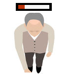
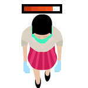

# Homework 6 for Epl133
## By Andreas Naziris and Konstantinos Larkos

This is a program for simulating infections, with communities.

## People
There are 4 kinds of people in this program.
1. Boomers, old people.  
    
2. Careful people.  
    
3. Normal people.  
    
4. Immune people.  
    

## Grids
There are 3 grids representing 3 seperate communities. They can be distinguished
in the StdDraw window by their slight differences in dimensions.
- The first one has less columns(fatter cells and people).
- The second one has as many columns as rows(square cells and people).
- The third one has less rows(taller cell and people).

The simulation shows 5 steps for each community and then switches to the next
one. Think of it like person in a control room with a single screen that
switches through 3 cameras. Each time 5 steps of a community are shown the same
5 steps for the other 2 communities are also executed behind the scenes but not
shown.

## Cells
- Orange cells are infected cells.
- White cells are normal non infected cells.
- Green cells are airport cells.

## Invariants
1. All probabilities are between 0 and 1 including those 2 values.
2. Vulnerabilities of people Boomer > Normal > Careful > Immune = 0.
3. Immune people can't get infected.
4. People can move in all direction(including diagonally) but only by one step.
5. Mobility of people Immune > Normal = Careful > Boomer.
6. People can't get out of the grid but if they try to in an "airport" cell they
   will get transported to the next community(assuming it's not full).
7. People can only get transported to the next community if conditions for 6 are
   met.
8. People will not get infected if they don't have infected neighbours and don't stand on infected cell.
9. There are only three communities with dimensions of 15x10, 12x12 and 10x15.
